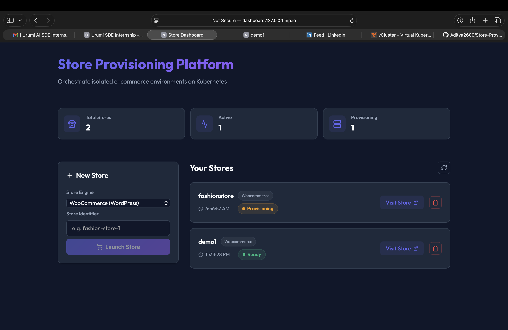
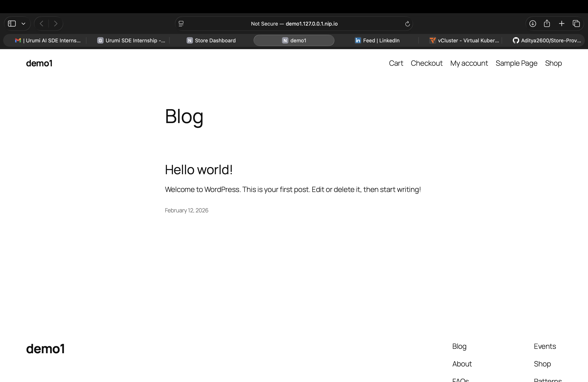
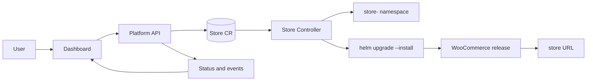
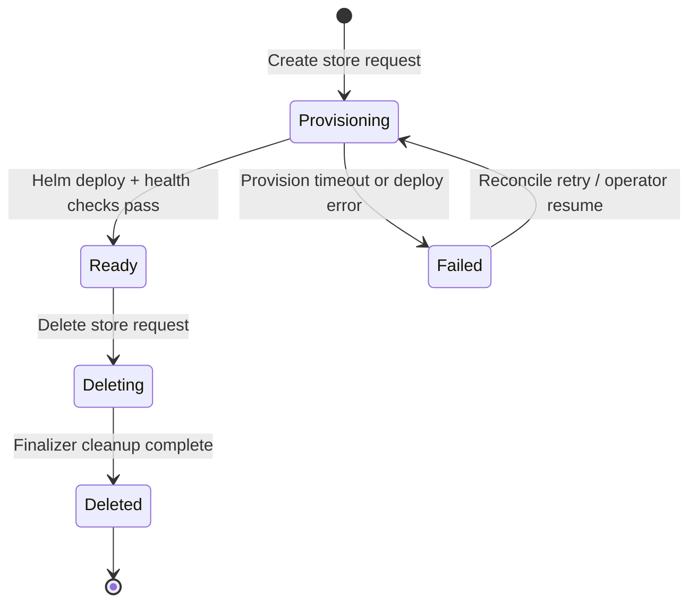
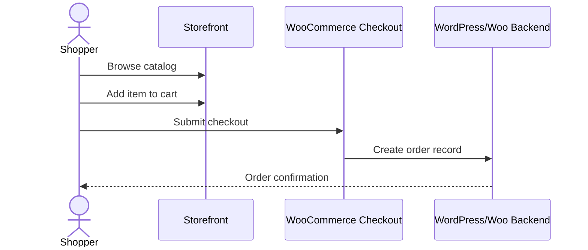

# Urumi Store Provisioning Platform (Round 1)

Kubernetes-native platform for provisioning isolated e-commerce stores on demand.
This README now includes the operational and design notes from:
- `docs/operations.md`
- `docs/system-design-tradeoffs.md`

## Demo

Dashboard:


Storefront:


## Source Code Layout

- Dashboard (frontend): `apps/dashboard`
- Backend API: `apps/api`
- Provisioning/orchestration controller: `controller/operator.py`
- Platform chart: `charts/platform`
- Store charts: `charts/woocommerce`, `charts/medusa`

## Flow Diagrams

### Control-plane architecture flow



### Store lifecycle flow (provisioning to cleanup)



### Shopper order flow



## Setup Instructions

### Local setup (Kind)

Prerequisites:
- Docker
- kubectl
- Helm
- Kind

Recommended one-command setup:

```bash
./setup.sh
```

Manual Helm install (equivalent local profile):

```bash
helm upgrade --install store-platform charts/platform \
  --namespace store-platform --create-namespace \
  -f charts/platform/values-local.yaml
```

Access endpoints:
- Dashboard: `http://dashboard.127.0.0.1.nip.io`
- API docs: `http://api.127.0.0.1.nip.io/docs`

### VPS / production-like setup (k3s)

1. Install k3s on your VPS.

```bash
curl -sfL https://get.k3s.io | sh -
```

2. Build and push images to your registry.

```bash
docker build -t your-repo/platform-api:latest -f apps/api/Dockerfile .
docker build -t your-repo/store-controller:latest -f controller/Dockerfile .
docker build --build-arg VITE_API_BASE=http://api.your-domain.com -t your-repo/dashboard:latest apps/dashboard

docker push your-repo/platform-api:latest
docker push your-repo/store-controller:latest
docker push your-repo/dashboard:latest
```

3. Start from `charts/platform/values-prod.yaml` and set:
- `baseDomain` to your real domain
- image references to your pushed tags
- ingress class/annotations for your ingress controller
- TLS/storage/replica/resource values for your environment

4. Deploy:

```bash
helm upgrade --install store-platform charts/platform \
  --namespace store-platform --create-namespace \
  -f charts/platform/values-prod.yaml
```

## How To Create a Store and Place an Order

### Create a store (Dashboard path)

1. Open the dashboard.
2. Enter a unique store ID, for example `fashion-boutique`.
3. Select engine `woocommerce`.
4. Click launch.
5. Wait for status transition `Provisioning -> Ready`.

### Create a store (API path)

```bash
curl -X POST http://api.127.0.0.1.nip.io/stores \
  -H 'Content-Type: application/json' \
  -d '{"engine":"woocommerce","storeId":"demo1"}'
```

Inspect status/events:

```bash
curl http://api.127.0.0.1.nip.io/stores/demo1 | jq
curl http://api.127.0.0.1.nip.io/stores/demo1/events | jq
```

### Place an order

1. Open the generated store URL from dashboard/API response.
2. Add a product to cart and proceed to checkout.
3. Place an order (COD flow is enabled by default in the demo setup).
4. Optional admin verification: use `/wp-admin` credentials from secret `store-<STORE_ID>/store-admin`.

## Helm Charts and Values (Local vs Prod)

Platform chart (`charts/platform`):
- `charts/platform/values.yaml`: baseline defaults
- `charts/platform/values-local.yaml`: local Kind profile (`nip.io`, local image wiring)
- `charts/platform/values-prod.yaml`: production-like profile (real domain, prod image refs, stricter resources)

Store charts:
- `charts/woocommerce`: WooCommerce store deployment wrapper
- `charts/medusa`: Medusa stub chart for next engine path

No chart fork is required between local and production-like setups; differences are values-driven.

## Operations Guide

### Platform install / upgrade

Install:

```bash
helm upgrade --install store-platform charts/platform \
  --namespace store-platform --create-namespace \
  -f charts/platform/values-local.yaml
```

Upgrade with production values:

```bash
helm upgrade store-platform charts/platform \
  --namespace store-platform \
  -f charts/platform/values-prod.yaml
```

### Rollback

```bash
helm history store-platform -n store-platform
helm rollback store-platform <REVISION> -n store-platform
```

### Store lifecycle operations

Create:

```bash
curl -X POST http://api.127.0.0.1.nip.io/stores \
  -H 'Content-Type: application/json' \
  -d '{"engine":"woocommerce","storeId":"demo1"}'
```

Inspect:

```bash
curl http://api.127.0.0.1.nip.io/stores/demo1 | jq
curl http://api.127.0.0.1.nip.io/stores/demo1/events | jq
```

Delete:

```bash
curl -X DELETE http://api.127.0.0.1.nip.io/stores/demo1
```

### Troubleshooting

Store stuck in provisioning:

```bash
kubectl logs -n store-platform deploy/store-controller -f
kubectl get stores.stores.urumi.ai -n store-platform <STORE_ID> -o yaml
kubectl get all -n store-<STORE_ID>
kubectl get events -n store-<STORE_ID> --sort-by=.lastTimestamp
```

Helm release failed:

```bash
helm list -n store-<STORE_ID>
helm status woocommerce-<STORE_ID> -n store-<STORE_ID>
```

Cleanup verification:

```bash
kubectl get ns store-<STORE_ID>
kubectl get ns store-<STORE_ID> -o yaml
```

### Demo checklist

1. Show architecture and component responsibilities.
2. Create a store from dashboard.
3. Show namespace/resources appearing.
4. Show status transitions to ready with URL.
5. Place/verify an order.
6. Delete store and verify namespace cleanup.
7. Explain guardrails, security posture, and rollback.

## System Design and Tradeoffs

### Architecture choice

This platform uses Kubernetes-native reconciliation with a custom `Store` CRD:
1. Dashboard/API are stateless control-plane services.
2. API writes desired state by creating/updating `Store` CRs.
3. Operator reconciles desired state into namespace + policies + per-store Helm release.

Tradeoff:
- More moving parts than a script-only approach.
- Better day-2 behavior: retries, self-healing, consistent status surfaces.

### Idempotency, failure handling, and cleanup

Idempotency:
- `POST /stores` is idempotent for the same `storeId + engine`.
- Operator provisioning uses `helm upgrade --install`.
- Reconciliation on resume re-attempts non-terminal stores.
- Namespace/policy reconciliation is upsert-style.

Failure handling:
- Explicit state transitions: `Provisioning -> Ready | Failed`.
- Step-level bounded event timeline in status.
- `status.lastError` tracks the latest failure.
- Concurrency caps (`MAX_CONCURRENT_PROVISIONS`) and timeout caps (`MAX_PROVISION_SECONDS`) reduce blast radius and hangs.

Cleanup:
- Finalizer-based delete flow: uninstall release, delete namespace, then remove finalizer.
- Delete path is resilient when resources are already absent.

### What changes for production

Key values and infra changes for a real environment:
1. DNS: replace `nip.io` with real DNS + ExternalDNS.
2. Ingress/TLS: production ingress class and cert-manager/managed certificates.
3. Storage class: managed CSI-backed class instead of local defaults.
4. Secrets: integrate Vault or cloud secrets manager for sensitive credentials.
5. Image registry/tags: immutable tags from CI/CD.
6. Resources/replicas: tune requests/limits and horizontal redundancy.
7. Observability: Prometheus/Grafana/log aggregation for operator and store workloads.
